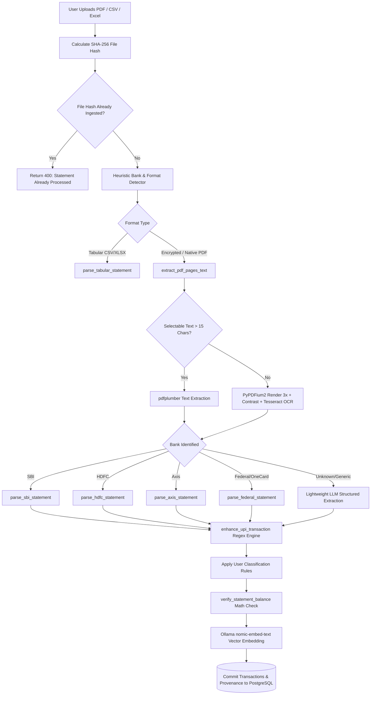

# 📋 Comprehensive Technical Project Report: WiseRaman

> **Target Audience:** External LLM Code & Architecture Reviewers (e.g., Claude 3.7 Sonnet, GPT-4o, DeepSeek-R1, Gemini 2.5 Pro).  
> **Document Purpose:** Provide an exhaustive, deeply detailed architectural, technical, security, domain, and implementation blueprint of the **WiseRaman** project to facilitate rigorous code review, architectural critique, gap analysis, and evolution planning.

---

## 1. Executive Summary & Core Mission

**WiseRaman** is a local-first, privacy-preserving, AI-powered personal financial intelligence operating system tailored specifically for the Indian banking and payments ecosystem. It operates entirely on-premise / localhost with zero telemetry or cloud leakage, processing multi-bank statement PDFs (SBI, HDFC, Axis, Federal Bank, OneCard), tabular netbanking exports, and corporate payslips.

### Primary Differentiators:
1. **100% Offline & Private AI Stack:** Combines **PostgreSQL 16 with `pgvector`** and **Ollama** running localized LLMs (`qwen2.5:3b`) and embedding models (`nomic-embed-text`). No transaction data, financial narrations, or metadata ever leave the user's host machine.
2. **Indian Financial Rails First-Class Support:** Native understanding of UPI (P2P vs P2M vs AutoPay vs Self-Transfer, UTRs, VPAs), NEFT, IMPS, RTGS, NACH mandates, BBPS, and bank charges (SMS charges, minimum balance penalties, GST surcharges).
3. **Deterministic Math & Balance Proofs:** Unlike heuristic or purely LLM-driven parsers, WiseRaman enforces cryptographic de-duplication (SHA-256 transaction fingerprinting) and exact mathematical balance proofs ($\text{Opening Balance} + \sum \text{Credits} - \sum \text{Debits} = \text{Closing Balance}$ within 5 paise precision) alongside human-in-the-loop review queues.
4. **Holistic Household & Wealth OS:** Spans beyond transaction tracking into salary payslip dissection (tax withholdings, EPF, take-home trajectory), reducing-balance loan amortization with prepayment simulators, bill splitting with participant settlement, insurance tracking, vehicle lifecycle cost tracking, and explainable 0–100 Financial Health Scoring.

---

## 2. Technology Stack & System Architecture

### 2.1 Architecture Diagram

```mermaid
graph TB
    subgraph Client Layer [Browser / Client Layer]
        ReactUI[React 18 + Vite SPA]
        Tailwind[Tailwind CSS v4 + Neumorphic System]
        Recharts[Recharts Visualization Engine]
        Context[FinanceContext + ToastContext + ThemeContext]
    end

    subgraph Service Layer [FastAPI Application Server]
        Auth[JWT + Passlib Bcrypt Auth]
        Parsers[Multi-Bank Deterministic & OCR Parsers]
        TaxEngine[Payslip & Tax Extraction Engine]
        ReconEngine[Reconciliation & Anomaly Engine]
        HealthScore[6-Pillar Health Score Calculator]
        CalendarSvc[Financial Calendar & Cashflow Engine]
        BackupSvc[Argon2id + AES-256-GCM .wbr Engine]
        AICopilot[Deterministic Query Planner & RAG]
    end

    subgraph Intelligence Layer [Local AI Service]
        Ollama[Ollama Local Server]
        LLM[Qwen 2.5 3B - Instruction & Synthesis]
        Embeddings[nomic-embed-text - 768-dim Vectors]
    end

    subgraph Storage Layer [Data & Persistence]
        PG[(PostgreSQL 16)]
        VectorExt[(pgvector Extension)]
        CryptoVault[(Encrypted .wbr Archives)]
    end

    ReactUI -->|HTTP / REST + Bearer JWT| Service Layer
    Parsers -->|pdfplumber / pypdfium2 / pytesseract| Service Layer
    AICopilot -->|Local REST API :11434| Ollama
    Ollama --> LLM
    Ollama --> Embeddings
    Service Layer -->|SQLAlchemy 2.0 ORM| PG
    Service Layer --> VectorExt
    BackupSvc --> CryptoVault
```

### 2.2 Component Technologies Breakdown

| Component | Technology | Version / Spec | Key Role & Configuration |
| :--- | :--- | :--- | :--- |
| **Backend Framework** | FastAPI | `0.110.0` | Async REST API, Pydantic validation, CORS middleware, OpenAPI autodocs. |
| **Server Engine** | Uvicorn | `0.28.0` | ASGI web server. |
| **Database & ORM** | PostgreSQL + SQLAlchemy | `16.0` / `2.0.28` | Relational tables, foreign key constraints, connection pooling, migrations. |
| **Vector Search** | pgvector | `0.2.5` | Native PostgreSQL vector storage, HNSW/IVFFlat indexing, cosine distance. |
| **Document Parsing** | pdfplumber + PyPDFium2 | `0.11.0` / `4.30.0` | Precise text extraction, table boundary parsing, coordinate extraction. |
| **OCR Fallback** | Tesseract (pytesseract) + Pillow | `0.3.10` / `10.3.0` | Fallback for scanned PDFs or PDFs rendered with non-standard vector glyphs. |
| **Local LLM Engine** | Ollama | Latest (`qwen2.5:3b`) | Private local inference, structured JSON output (`format="json"`), 4096 ctx. |
| **Local Embeddings** | Ollama | `nomic-embed-text` | 768-dimensional dense vector embeddings for semantic transaction search. |
| **Financial Math** | pyxirr, custom decimal math | `0.9.3` | Financial rates of return, XIRR calculation, loan reducing amortization. |
| **Security & Cryptography** | cryptography, passlib, python-jose | AES-256-GCM, Argon2id | DEK/KEK wrapped key hierarchy, bcrypt passwords, JWT auth tokens. |
| **Frontend Framework** | React 18 + Vite | `18.3.1` / `5.3.1` | Single-page application, code splitting, reactive state hooks. |
| **Styling & UI** | Tailwind CSS v4 + Lucide Icons | `4.0.0` / `0.379.0` | Custom dual-theme neumorphic design system (Dark `#181828` / Light `#E0E5EC`). |
| **Charts & Data Viz** | Recharts | `2.12.7` | Responsive area charts, stacked bar charts, donut velocity dials. |
| **Containerization** | Docker Compose | Compose v2 | Multi-container isolation: `db`, `ollama`, `backend`, `frontend`. |

---

## 3. Database Schema & Data Models

The database contains over 20 relational entities declared in [`backend/app/models.py`](file:///home/abhay/Documents/antigravity/wise-raman/backend/app/models.py), organized across 7 distinct domain phases:

### 3.1 Core Banking & Ledger Entities
1. **`User` (`users`)**:
   - `id` (UUIDv4 PK), `email` (unique index), `name`, `password_hash` (bcrypt), `created_at`.
2. **`Bank` (`banks`)**:
   - `id` (UUID PK), `user_id` (FK), `name` (e.g., SBI, HDFC, Axis, Federal Bank).
3. **`Account` (`accounts`)**:
   - `id` (UUID PK), `user_id`, `bank_id`, `account_number_masked` (`XXXX`), `name`, `balance` (`Numeric(14,2)`), `classification` (Enum: `ASSET`, `LIABILITY`), `subtype` (Enum: `SAVINGS`, `CURRENT`, `CREDIT_CARD`, `LOAN`, `INVESTMENT`, `TAX`), `visibility` (Enum: `PRIVATE`, `SHARED`, `HOUSEHOLD`), `credit_limit`, `available_limit`, `billing_cycle_day`.
4. **`CreditCard` (`credit_cards`)**:
   - 1:1 metadata linked to `Account` with card properties: `card_name`, `network` (`Visa`, `Mastercard`, `RuPay`, `Amex`), `reward_currency` (`Cashback`, `Reward Points`, `Miles`), `monthly_cap`, `statement_date`, `is_active`.
5. **`CreditCardStatement` (`credit_card_statements`)**:
   - Statement cycles: `statement_date`, `due_date`, `period_start_date`, `period_end_date`, `previous_dues`, `payments_received`, `purchases_debits`, `finance_charges`, `total_amount_due`, `minimum_amount_due`.
6. **`Transaction` (`transactions`)**:
   - Primary financial ledger record:
     - `id`, `user_id`, `account_id`, `statement_id`.
     - `date` (Transaction date), `value_date`.
     - `raw_text` (Original bank narration string).
     - `description` (Cleaned merchant / counterparty name).
     - `category`, `subcategory`.
     - `transaction_type` (Enum: `INCOME`, `EXPENSE`, `TRANSFER_INTERNAL`, `CC_BILL_PAYMENT`, `CC_PAYMENT_RECEIVED`, `REFUND_REVERSAL`, `BANK_FEE_INTEREST`).
     - `amount` (`Numeric(14,2)`: `+` Cash In, `-` Cash Out).
     - `running_balance`, `reference_id`, `fingerprint` (SHA-256 cryptographic hash).
     - **UPI Native Columns**: `upi_type` (`P2P`, `P2M`, `SELF_TRANSFER`, `COLLECT`, `AUTOPAY`, `UNKNOWN`), `upi_vpa`, `utr_number`.
     - **Document Provenance Columns**: `source_document_id`, `source_page_number`, `source_coordinates` (`"x,y,w,h"`), `extraction_confidence` (`Numeric(4,3)`).
     - **Flags & Vector**: `is_excluded_from_spending` (boolean), `verified` (boolean), `embedding` (`Vector(768)`).

### 3.2 Tax, Wealth & Payslip Models
7. **`Payslip` (`payslips`)**:
   - Structured salary slip metadata: `employee_id`, `employee_name`, `company_name`, `period_month`, `period_year`, `bank_account_no`.
   - **Earnings**: `basic_salary`, `hra`, `special_allowance`, `other_earnings`, `gross_earnings`.
   - **Deductions**: `provident_fund` (EPF), `professional_tax` (PT), `income_tax_tds` (TDS), `other_deductions`, `gross_deductions`.
   - **Take-Home**: `net_pay`, `account_id`, `transaction_id` (foreign key auto-linking payslip to the bank credit transaction).
8. **`InvestmentAccount` & `InvestmentHolding` (`investment_accounts`, `investment_holdings`)**:
   - Brokerage accounts (Zerodha, Groww, Angel One), holdings tracking `ticker`, `isin`, `asset_class` (Equity, Debt, Gold), `units`, `average_price`, `current_price`, `invested_value`, `current_value`, `as_of_date`.
9. **`FixedDeposit` (`fixed_deposits`)**:
   - FD/RD tracker: `deposit_type`, `principal_amount`, `interest_rate`, `start_date`, `maturity_date`, `maturity_amount`, `is_active`.
10. **`TaxRecord` (`tax_records`)**:
    - Indian tax documents: `financial_year` (`2025-26`), `record_type` (`FORM_16`, `AIS`, `TIS`, `ADVANCE_TAX`), `gross_income`, `exemptions`, `deductions` (80C/80D), `taxable_income`, `tax_paid`.

### 3.3 Household Financial OS Models
11. **`HouseholdMember` (`household_members`)**:
    - Multi-user family members: `name`, `relationship` (`SPOUSE`, `PARENT`, `CHILD`, `SELF`), `avatar_color`.
12. **`Loan` (`loans`)**:
    - Reducing balance amortization: `loan_name`, `loan_type` (`HOME_LOAN`, `CAR_LOAN`, `PERSONAL_LOAN`, `EDUCATION_LOAN`), `lender_name`, `principal_amount`, `outstanding_balance`, `annual_interest_rate`, `emi_amount`, `tenure_months`, `remaining_tenure_months`, `start_date`, `next_due_date`.
13. **`FinancialGoal` (`financial_goals`)**:
    - Goals & Emergency Funds: `name`, `category` (`EMERGENCY_FUND`, `VACATION`, `CAR`, `HOUSE`, `RETIREMENT`), `target_amount`, `current_amount`, `monthly_contribution`, `priority`, `is_completed`.
14. **`InsurancePolicy` (`insurance_policies`)**:
    - Protection audit: `policy_name`, `policy_type` (`HEALTH`, `LIFE`, `TERM`, `VEHICLE`), `insurer_name`, `sum_insured`, `premium_amount`, `premium_frequency`, `renewal_date`, `covered_members`.
15. **`SplitExpense` & `SplitParticipant` (`split_expenses`, `split_participants`)**:
    - Shared expense ledger: `title`, `total_amount`, `paid_by_user`, `payer_name`, `expense_date`, linked participants with `share_amount` and boolean `is_settled`.
16. **`Vehicle` & `VehicleExpense` (`vehicles`, `vehicle_expenses`)**:
    - Vehicle operating cost & mileage: `vehicle_name`, `vehicle_type`, `registration_number`, `fuel_type`, `odometer_reading`, expenses categorized by `FUEL`, `FASTAG`, `SERVICE`, `INSURANCE`, `TOLL`, `EMI` with liters and fuel efficiency calculations.
17. **`TravelTrip` & `TripExpense` (`travel_trips`, `trip_expenses`)**:
    - Dedicated trip envelopes (e.g. "Goa Trip 2026"): budget tracking, flight/hotel/food category breakdown.

### 3.4 Data Integrity, Auditability & Governance Models
18. **`DocumentSource` (`document_sources`)**:
    - Cryptographic document provenance: `file_name`, `file_hash_sha256`, `file_type`, `parser_name`, `parser_version`, `total_pages`, `extracted_rows_count`.
19. **`StatementReconciliation` (`statement_reconciliations`)**:
    - Balance validation records: `period_start`, `period_end`, `opening_balance`, `total_credits`, `total_debits`, `closing_balance`, `expected_closing_balance`, `discrepancy_amount`, `status` (`VERIFIED` vs `MISMATCH_FLAGGED`).
20. **`UserClassificationRule` (`user_classification_rules`)**:
    - Deterministic categorization override hierarchy: `match_pattern`, `match_field` (`raw_text`, `description`, `vpa`), `target_category`, `target_subcategory`, `is_excluded_from_spending`, `priority` (integer, evaluated high-to-low).
21. **`MandateRecord` (`mandate_records`)**:
    - Recurring commitments: `biller_name`, `mandate_type` (`UPI_AUTOPAY`, `NACH`, `ECS`, `STANDING_INSTRUCTION`), `amount`, `frequency`, `next_debit_date`.
22. **`BankFeeRecord` (`bank_fee_records`)**:
    - Bank charges auditor: `fee_type` (`ATM_FEE`, `SMS_CHARGE`, `MIN_BALANCE_PENALTY`, `CARD_ANNUAL_FEE`, `IMPS_CHARGE`), `amount`, `fee_date`, `is_avoidable`.
23. **`AIChatSession` & `AIChatMessage` (`ai_chat_sessions`, `ai_chat_messages`)**:
    - Full conversational state with LLM, storing `evidence_payload` JSON alongside responses for factual verification.

---

## 4. Statement Ingestion & Parsing Subsystem

Processing Indian bank statements is notoriously difficult due to password encryption, inconsistent layout formats, missing table grids, embedded vector glyphs, and ambiguous transaction narrations. WiseRaman solves this using a multi-tiered pipeline:

### 4.1 Parser Hierarchy & Execution Flow



### 4.2 Bank-Specific Parser Details ([`parser.py`](file:///home/abhay/Documents/antigravity/wise-raman/backend/app/parser.py))
- **HDFC Bank Savings & Tata Neu / Millennia Cards:**
  - Extracts statement summaries with regex: `TOTAL AMOUNT DUE`, `PREVIOUS STATEMENT DUES`, `AVAILABLE CREDIT LIMIT`.
  - Distinguishes payments (`+ C`, `CC PAYMENT`, `AUTODEBIT`) from merchant spends.
- **SBI Savings Passbook & SBI SimplyCLICK / Cashback Cards:**
  - Processes 4-column date, description, amount, and `[C/D/M]` credit/debit indicators.
  - Handles the SBI closing balance formula table (`Brought Forward | Dr Count | Cr Count | Total Debits | Total Credits | Closing Balance`).
- **Axis Bank (Airtel Axis Mastercard, Neo, Flipkart Axis):**
  - Extracts `Payment Summary` blocks and parses table markers up to `**End of Transaction Summary**`.
- **Federal Bank & OneCard (FPL Technologies):**
  - Parses `STATEMENT ILLUSTRATION` blocks, detects `Repayments` and `Paid Via Upi` rows as credits, and normalizes reward point counters.
- **Corporate Payslip Parser (`parse_payslip`):**
  - Extracts PDF text and prompts `qwen2.5:3b` with a strict Pydantic JSON schema to extract gross pay, net pay, Basic, HRA, EPF, and tax TDS. It automatically queries `transactions` to match the exact Net Pay credit in the user's bank accounts.

### 4.3 Deterministic Indian Merchant Engine ([`merchant_map.py`](file:///home/abhay/Documents/antigravity/wise-raman/backend/app/merchant_map.py))
Contains pre-compiled regex pattern rules for over 100 Indian platforms across categories:
- **Food Delivery & Quick Commerce:** Swiggy, Swiggy Instamart, Zomato, Blinkit/Grofers, Zepto, BigBasket, Dunzo, EatClub/Box8, Domino's, Chaayos.
- **E-Commerce & Retail:** Amazon, Flipkart, Myntra, Meesho, Ajio, Nykaa, Tata 1mg, Apollo Pharmacy, IKEA, Decathlon.
- **Travel, Transit & Fuel:** IRCTC, MakeMyTrip, Goibibo, EaseMyTrip, IndiGo, Air India, Vistara, Uber, Ola, Rapido, BluSmart, HPCL, BPCL, IOCL, Shell, FASTag/NETC.
- **Subscriptions & Digital Services:** Netflix, Disney+ Hotstar, Prime Video, Spotify, YouTube Premium, Apple Services, ChatGPT/OpenAI, GitHub.
- **Utilities & Telecom:** Airtel, Jio, Vodafone Idea, State Electricity Boards (BESCOM, MSEDCL, TSSPDCL, Tata Power), Gas utilities (IGL, MGL, Adani Gas, Indane), CRED, BillDesk, BBPS.
- **Investments & Insurance:** Zerodha, Groww, Angel One, Upstox, INDmoney, CAMS/KFINTECH, LIC, HDFC Life, Star Health.

---

## 5. Local AI & Semantic RAG Subsystem

WiseRaman rejects external cloud LLM APIs (OpenAI, Anthropic, Gemini API) in favor of **100% on-premise hardware execution**.

### 5.1 Architecture & Models
- **Host Endpoint:** `http://finance_ollama:11434` (with automated network fallback to `http://localhost:11434`, `http://host.docker.internal:11434`).
- **Synthesis LLM:** `qwen2.5:3b` (configured for fast deterministic inference with `temperature=0.0`, `keep_alive=30m`, GPU offload `num_gpu=-1`).
- **Vector Embedding Model:** `nomic-embed-text` producing 768-dimensional dense vector embeddings.
- **Indexing:** Embeddings are persisted in PostgreSQL using the `pgvector` extension.

### 5.2 RAG Query Pipeline ([`ai.py`](file:///home/abhay/Documents/antigravity/wise-raman/backend/app/ai.py))
1. User enters natural language prompt in the AI Assistant (e.g., *"How much did I spend on food delivery in July?"*).
2. The query is converted into a 768-dim vector embedding via Ollama `/api/embed`.
3. Vector similarity search executes in PostgreSQL using cosine distance:
   ```sql
   SELECT * FROM transactions
   WHERE user_id = :user_id AND embedding IS NOT NULL
   ORDER BY embedding <=> :query_vector
   LIMIT 24;
   ```
4. Top 24 matching transactions are formatted into structured tabular context lines:
   `DATE | DESCRIPTION | AMOUNT (IN/OUT) | CATEGORY/SUBCATEGORY | BANK`
5. A tightly bounded prompt is fed to `qwen2.5:3b` with instructions to rely strictly on verified context and compute exact aggregates.
6. Execution telemetry logs time-to-embed, vector search duration, generated token count, and tokens-per-second rate.

### 5.3 Deterministic AI Copilot & Redaction ([`ai_copilot/`](file:///home/abhay/Documents/antigravity/wise-raman/backend/app/ai_copilot/))
To avoid SQL injection or hallucinated calculations from smaller models:
- **`FinancialQueryPlanner`:** Parses user intent into structured dimensions (`category`, `date_range`, `intent=SUM/COMPARE`) and runs deterministic SQLAlchemy aggregation.
- **`PrivacyRedactor`:** Automatically strips Indian PII before passing text to the LLM:
  - Account numbers masked to last 4 digits (`\b\d{10,18}\b` $\rightarrow$ `XXXXXX1234`).
  - Indian PAN card numbers masked (`[A-Z]{5}[0-9]{4}[A-Z]{1}` $\rightarrow$ `XXXXX1234X`).
  - Mobile numbers masked (`[6-9]\d{9}` $\rightarrow$ `XXXXX67890`).
  - UPI handles and email addresses normalized.

---

## 6. Financial Intelligence Services & Mathematical Engines

The core business logic resides in [`backend/app/services/`](file:///home/abhay/Documents/antigravity/wise-raman/backend/app/services/):

### 6.1 Explainable Financial Health Score Engine (`health_score.py`)
Computes an explainable 0–100 score across 6 weighted pillars with continuous interpolation curves:
1. **Savings Rate (25% weight):** $\text{Savings Rate} = \frac{\text{Monthly Income} - \text{Monthly Expenses}}{\text{Monthly Income}} \times 100$. Curve: 0% = 0 pts, 20% = 60 pts, 40%+ = 100 pts.
2. **Debt Burden / FOIR (20% weight):** Fixed Obligation to Income Ratio ($\frac{\text{Monthly EMI}}{\text{Monthly Income}}$). Curve: 0% = 100 pts, 30% = 70 pts, 50%+ = 0 pts.
3. **Emergency Reserve Coverage (20% weight):** Months of living expenses covered by liquid savings ($\frac{\text{Liquid Reserves}}{\text{Essential Monthly Burn}}$). Curve: 0 mos = 0 pts, 3 mos = 60 pts, 6+ mos = 100 pts.
4. **Credit Utilization (15% weight):** Overall credit card balance to credit limit ratio. Curve: $<30\%$ = 100 pts, 50% = 60 pts, 80%+ = 0 pts.
5. **Investment Regularity (10% weight):** Monthly investment ratio to income. Curve: 0% = 0 pts, 15%+ = 100 pts.
6. **Cash Flow Stability (10% weight):** Positive free cash buffer after expenses and obligations.
- **Data Sufficiency Guard:** If transaction history is $< 3$ months or income $\le 0$, score generation is suspended to avoid misleading metrics, outputting an informative "Not enough data yet" diagnosis with a confidence score.

### 6.2 Calibrated Spending Anomaly Radar (`anomaly_detector.py`)
Detects irregular high-value transactions using statistical safeguards:
- Calculates 90-day median and standard deviation per merchant.
- Applies merchant-calibrated multipliers (Shopping 4.0x, Dining 3.0x, Utilities 2.0x).
- **Suppression Safeguards:**
  - Minimum absolute floor of ₹2,000 to prevent small anomaly noise (e.g. ₹50 vs ₹10).
  - Sample size gating: minimum 3 historical transactions required.
  - Automatic bypass for non-discretionary categories (Rent, EMI, Insurance, Salary, Transfers).
- Outputs non-alarmist severity ratings: *Elevated*, *Anomalous*, *Highly Anomalous*.

### 6.3 Financial Calendar & Cash Flow Forecaster (`financial_calendar.py`)
Builds a 30-day chronological schedule integrating:
- Expected salary credits.
- House rent due dates.
- Credit card statement due dates and outstanding dues.
- Loan EMI debits.
- Mutual fund SIPs, NACH, and UPI AutoPay mandates.
- Insurance renewal premiums.
- Calculates dynamic daily balance trajectory and alerts if projected month-end liquidity dips below zero.

### 6.4 Lifestyle Inflation & Economic Savings Engine (`lifestyle_inflation.py`)
- **Lifestyle Inflation Gap:** Measures the disparity between discretionary spending growth rate and income growth rate ($\Delta = \text{Discretionary Growth \%} - \text{Income Growth \%}$). Flags lifestyle creep when discretionary spend accelerates $>5\%$ faster than earnings.
- **True Economic Savings Rate:** Fixes the common flaw in naive personal finance tools that treat loan principal payments as pure expenses. Combines Cash Savings + Mutual Funds/SIPs + Loan Principal Repayments divided by Gross Income.
- **Subscription Waste Detection:** Tracks recurring subscriptions (Netflix, Spotify, Prime, ChatGPT, Cult.fit) and surfaces annual recurring expense drain.

### 6.5 Reducing Balance Loan Amortization Engine (`loans.py`)
- Computes exact monthly amortization schedules for Home, Car, and Personal loans using reducing balance monthly interest compounding:
  $$\text{EMI} = P \times r \times \frac{(1+r)^n}{(1+r)^n - 1}$$
- **Prepayment Simulator:** Allows users to model lump-sum prepayments or regular extra monthly contributions, calculating total interest savings and tenure reduction in months.

### 6.6 Cryptographic Backup & Portability Engine (`backup_service.py`)
Implements the proprietary `.wbr` (WiseRaman Backup & Restore) archive format:
- **Key Hierarchy:** Wrapped Key Encryption Key (KEK) and Data Encryption Key (DEK).
- **KDF:** Argon2id (salt: 16 bytes, memory cost: 64MB, 3 iterations, 4 lanes) derives the 256-bit KEK from the user's master passphrase.
- **Cipher:** AES-256-GCM authenticated encryption with 12-byte random nonces for both the DEK and the data payload.
- **Integrity:** SHA-256 integrity checksums stored in manifest.
- **Self-Verifying Restore:** `/api/backup/test-restore` endpoint performs in-memory trial decryption and JSON schema validation without mutating the live database.

---

## 7. Frontend Design & User Interface

The frontend is a single-page application built with React 18, Vite, and Tailwind CSS v4, adhering to a custom neumorphic aesthetic:

### 7.1 Key Views & Features
1. **Dashboard View (`DashboardView.jsx`):**
   - Hero alert ribbon with financial status badges.
   - Credit card summary deck (credit limit, current spend, utilization ratio).
   - Net worth aggregation card (liquid cash, investments, liabilities).
   - Subscription tracker card.
   - Multi-timeframe income vs expense trend charts.
   - Month velocity dial and category donut cards.
2. **Review Center (`ReviewCenterView.jsx`):**
   - Mathematical balance reconciliation proofs per account with 5-paise verification tags.
   - 4-tier human-in-the-loop review queue (Critical, Important, Review, Informational).
   - Document provenance modal showing source PDF name, page number, and bounding box coordinates.
   - User classification rules editor with interactive historical simulation before saving.
   - Encrypted `.wbr` backup export and test restore console.
3. **Financial Health OS (`FinancialHealthView.jsx`):**
   - Interactive 0–100 health dial with pillar breakdown cards.
   - 365-day calendar heatmap visualizing daily spend intensity.
   - Unusual spending anomaly radar with merchant baselines.
   - Lifestyle inflation gap and True Economic Savings Rate metrics.
4. **Household OS (`HouseholdOSView.jsx`):**
   - Multi-member family accounts overview with avatar tags.
   - Loan management with full amortization tables and prepayment simulator.
   - Financial goal cards and emergency fund runway meter.
   - Bill splitting module with participant breakdown and settlement actions.
   - Insurance policy coverage tracker.
   - Vehicle maintenance and fuel efficiency log (cost per kilometer, fuel liters, odometer).
   - Vacation travel trip envelopes with dedicated budgets.
5. **Salary & Payslips (`PayslipsView.jsx`):**
   - Drill-down payslip cards: Basic, HRA, Allowances, PF, PT, TDS withholdings, and take-home ratio.
   - Deduction trajectory timeline comparing gross earnings to net pay.
   - Auto-matched bank salary credit ledger links.
6. **Card Portfolio View (`CardPortfolioView.jsx`):**
   - Visual credit card stack with billing cycles, payment due alerts, and statement upload history.
7. **Transaction Ledger (`TransactionLedgerView.jsx`):**
   - Comprehensive filterable ledger with instant text search, category filtering, UPI VPA search, and inline category editing.
8. **Local AI Assistant (`AiAssistantView.jsx`):**
   - Conversational chat interface with Qwen 2.5 3B.
   - Ollama connection manager and model selection settings.
   - Real-time telemetry terminal showing embedding latency, prompt tokens, and tokens/sec inference speed.

---

## 8. Security, Privacy & Data Governance

WiseRaman was designed under strict zero-trust, local-only assumptions:

1. **Zero External Network Exfiltration:** All AI operations execute via Ollama on `localhost:11434`. No external API keys or cloud services are invoked.
2. **Database Isolation & Scoping:** Every SQL query explicitly filters by `user_id` authenticated via signed JWT bearer tokens (`python-jose`).
3. **Password Hashing:** Passwords hashed with `passlib` using `bcrypt`.
4. **PII Masking Layer:** Privacy redactor masks bank account numbers, PANs, phone numbers, and UPI handles prior to sending context to LLM generation.
5. **Secure Backups:** Exported `.wbr` files are fully encrypted using Argon2id and AES-256-GCM. Unencrypted JSON export requires explicit two-step user confirmation.
6. **Double-Counting Prevention:** Internal transfers (such as bank transfers to pay a credit card bill) are marked with `is_excluded_from_spending = true` to prevent false expense inflation.

---

## 9. Comprehensive API Reference Map

The FastAPI backend exposes over 50 REST endpoints organized cleanly:

| Domain | Method & Route | Description |
| :--- | :--- | :--- |
| **Auth** | `POST /api/auth/register` | User signup with bcrypt password hashing |
| | `POST /api/auth/login` | Returns JWT bearer access token |
| **Accounts** | `GET /api/banks` / `POST /api/banks` | Manage financial institutions |
| | `GET /api/accounts` / `POST /api/accounts` | Create and list savings, credit, investment accounts |
| | `DELETE /api/accounts/{account_id}` | Cascade deletes an account and all its transactions |
| **Statements** | `POST /api/upload` | Universal upload endpoint (PDF, CSV, Excel) with SHA-256 de-duplication |
| | `POST /api/payslips/upload` | AI extraction of salary slips via Ollama |
| | `GET /api/payslips` | List historical payslips with statutory deduction breakdown |
| **Ledger** | `GET /api/transactions` | Query transactions with pagination and date/category filters |
| | `PUT /api/transactions/{id}` | Update category, verification status, or exclude flag |
| | `DELETE /api/transactions/{id}` | Delete individual transaction record |
| | `DELETE /api/transactions/purge` | Purge all transaction data for the current user |
| **AI & RAG** | `POST /api/chat` | RAG query answering against `pgvector` embeddings |
| | `GET /api/ai/logs` / `GET /api/backend/logs` | Real-time inference telemetry logs |
| | `GET /api/settings/llm` / `POST /api/settings/llm` | Configure Ollama host, models, and context window |
| | `POST /api/settings/test-ollama` | Probe live Ollama connection and fetch installed models |
| **Integrity & Review** | `GET /api/reconciliation/dashboard` | Mathematical balance proofs for all statements |
| | `GET /api/review-queue` | 4-tier human-in-the-loop review queue |
| | `POST /api/review-queue/resolve` | Resolve review item (recategorize, confirm, or add rule) |
| | `GET /api/provenance/{transaction_id}` | Return PDF page and coordinate provenance |
| | `GET /api/rules` / `POST /api/rules` | Manage deterministic classification override rules |
| | `POST /api/rules/test` | Simulate rule impact on historical data before saving |
| **Analytics & Health** | `GET /api/health-score` | Explainable 0–100 Financial Health Score & 6 pillars |
| | `GET /api/analytics/anomalies` | Multi-signal spending anomaly radar |
| | `GET /api/analytics/financial-calendar` | 30-day cash flow schedule & month-end projection |
| | `GET /api/analytics/lifestyle-inflation` | Lifestyle creep gap & True Economic Savings Rate |
| | `GET /api/analytics/mandates-fees` | Detected bank fees and active recurring mandates |
| | `GET /api/net-worth` | Asset vs liability balance sheet breakdown |
| | `GET /api/subscriptions` | Detected recurring software & entertainment subscriptions |
| **Household OS** | `GET /api/household/dashboard` | Multi-member family financial overview |
| | `GET /api/household/members` / `POST` / `DELETE` | Manage household members |
| | `GET /api/loans` / `POST /api/loans` | Track loans and reducing balance principal |
| | `GET /api/loans/{id}/amortization` | Full monthly amortization schedule |
| | `POST /api/loans/{id}/prepayment-sim` | Simulate lump-sum and extra EMI interest savings |
| | `GET /api/goals` / `POST /api/goals` | Emergency funds and target-based financial goals |
| | `GET /api/splits` / `POST /api/splits` | Bill splitting and peer expense management |
| | `POST /api/splits/participant/{id}/settle` | Settle individual split shares |
| | `GET /api/insurance` / `POST /api/insurance` | Insurance policy registry and renewal tracking |
| | `GET /api/vehicles` / `POST /api/vehicles` | Vehicle operating expenses and mileage analysis |
| | `GET /api/trips` / `POST /api/trips` | Group travel trips and expense tracking |
| **Backup** | `POST /api/backup/export-wbr` | Export encrypted `.wbr` archive (Argon2id + AES-256-GCM) |
| | `POST /api/backup/test-restore` | In-memory verification of backup decryption and integrity |
| | `POST /api/backup/export-plain` | Unencrypted JSON export |

---

## 10. Suggested Prompts for External LLM Review

When sharing this report with another LLM (e.g. Claude 3.7 Sonnet, GPT-4o, DeepSeek-R1), use the following targeted prompts to extract high-value critiques:

### Prompt Option 1: Full Architectural & Engineering Review
> *"I am providing the comprehensive architecture and specification report of WiseRaman, a privacy-first, local AI personal finance platform for the Indian banking ecosystem. Please perform a rigorous review covering: (1) Architectural strengths and potential scalability bottlenecks; (2) Data model integrity and edge cases in Indian financial rails (UPI, credit cycles, NACH); (3) Security and local AI latency optimizations (pgvector indexing, small LLM quantization); and (4) Priority recommendations for production hardening."*

### Prompt Option 2: Security & Privacy Audit
> *"Please act as a Principal Security Architect reviewing WiseRaman's local-first architecture. Analyze our encryption strategy (.wbr with Argon2id + AES-256-GCM), PII redaction pipeline, user isolation, and local LLM execution. Identify any potential attack vectors, cryptographic weaknesses, or unintended privacy leakage risks."*

### Prompt Option 3: Financial Engineering & Modeling Review
> *"Review the financial mathematical models in WiseRaman: (1) The 6-pillar continuous Financial Health Score; (2) True Economic Savings Rate vs traditional savings rate; (3) 3.0x spending anomaly detection with statistical gating; and (4) Reducing balance loan amortization and prepayment simulation. Are there mathematical or domain flaws, and how can these algorithms be enhanced to better reflect Indian taxation (Old vs New Regime) and macroeconomic factors?"*

---

*Report compiled for WiseRaman — Engineered with privacy, deterministic precision, and local intelligence.*
