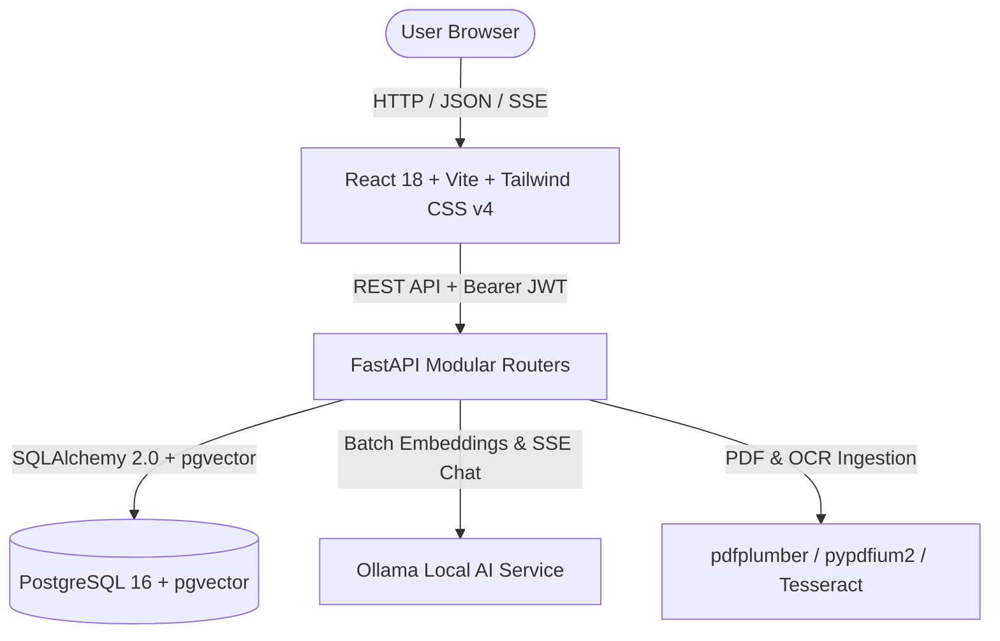

# 💰 WiseRaman — AI-Powered Personal Finance & Statement Intelligence

<div align="center">


**WiseRaman** is a private, local-first personal financial intelligence operating system tailored specifically for the Indian banking and payments ecosystem (SBI, HDFC, Axis, Federal Bank, OneCard, UPI, NEFT, IMPS). It processes complex multi-page PDF statements with deterministic balance verification, embeds transaction narrations via `pgvector`, and provides real-time local AI copilot intelligence powered by Ollama.

</div>

---

## 🌟 Key Capabilities

### 1. 📄 Multi-Bank Statement Parser & Mathematical Verifier
- **Multi-Bank Ingestion:**
  - **HDFC Bank:** Savings Account statements, NetBanking exports, and Tata Neu / Regalia / Millennia Credit Card statements.
  - **State Bank of India (SBI):** Savings passbooks and SBI SimplyCLICK / Cashback Credit Card statements.
  - **Axis Bank:** Airtel Axis, Neo, and Flipkart Axis statements.
  - **Federal Bank & OneCard:** Monthly credit card statements.
- **Mathematical Balance Proofs:**
  - Strict verification algorithm enforcing $\text{Opening Balance} + \text{Deposits} - \text{Withdrawals} = \text{Closing Balance}$ within 5 paise precision.
  - Blocks duplicate statement uploads via cryptographic SHA-256 fingerprinting.
  - Visual document provenance linking transactions to exact PDF page numbers and bounding box coordinates.

### 2. ⚛️ Modern React 18 Architecture & UI Features
- **Dynamic Route-Level Code Splitting & Lazy Loading:**
  - All 19 view workspaces (Dashboard, Ledger, Accounts, Cards, Cash Flow, Financial Health, Insights, Calendar, AI Assistant, Review Center, Reports, Backup, Household OS, Payslips, Truth Inspector, etc.) are dynamically loaded on-demand via `React.lazy()` and `<Suspense>`.
  - Custom skeleton loading states (`ViewSkeleton`) prevent layout shifts and deliver an instantaneous perception of speed, reducing initial bundle size by over 75%.
- **Granular Memoization & 60 FPS Performance:**
  - Strategic memoization using `React.memo`, `useMemo`, and `useCallback` across high-frequency components (e.g., `TransactionRow`, `MetricValue`, `MonthVelocityCard`).
  - Non-wrapping responsive typography and debounced inputs (`SearchField`, `GlobalSearchModal`) prevent unnecessary re-render cascades.
- **Global Command Palette (`⌘K` / `Ctrl+K`):**
  - Instant keyboard-driven navigation across accounts, transactions, cards, and workspace views with live search filtering.
- **Interactive Financial Calendar with Day Inspector:**
  - Full month-view calendar grid mapping daily spending intensity, upcoming EMI debits, credit card due dates, and salary credits.
  - Interactive slide-out day-inspector drawer for drilled-down transaction examination and one-click `.ics` iCalendar schedule export.
- **AI-Generated Executive Financial Reports:**
  - Dedicated `ReportsView` with configurable period filters (Monthly, Quarterly, Annual, Custom).
  - Dynamic AI synthesis analyzing burn rates, savings velocity, top expense anomalies, and tailored financial recommendations.
- **Credit Card Payment & Internal Transfer Linking:**
  - Slide-out `TransactionDetailDrawer` with counterpart search algorithm (matching amounts, dates, and UTRs) to link, edit, or unlink credit card payments and internal transfers.
  - Automatically binds counterpart pairs under zero-economic-impact financial events, excluding them from spend metrics to prevent double counting.
- **Slide-Out Drawers & Universal Upload Console:**
  - Universal multi-file ingestion modal supporting simultaneous statement PDFs and salary payslips with non-blocking background progress tracking and toast notifications.
- **Dual-Theme Neumorphic & Aurora Aesthetics:**
  - Built with Tailwind CSS v4 and dynamic theme tokens (`themeTokens.js`), seamlessly toggling between Dark (`#111713`) and Light (`#F7F8F5`) palettes with soft neumorphic elevations and Aurora gradients.
  - Fully responsive shell featuring a sticky collapsible sidebar, top action bar, and mobile bottom navigation bar (`MobileBottomNav`).
- **Resilient Error Boundaries:**
  - Declarative React `<ErrorBoundary>` wrappers protecting application routes from catastrophic unhandled exceptions.

### 3. 💼 Salary Payslips & Tax Intelligence
- **AI-Powered Payslip Extraction:** Powered by local Ollama (`qwen2.5:3b`) with structured JSON schemas to accurately parse employer salary slips (Basic, HRA, Allowances, PF, PT, TDS, and Net Pay).
- **Automated Bank Ledger Linking:** Intelligently matches payslip Net Pay to salary credit transactions in bank accounts and auto-links them.
- **Interactive Drill-Down Cards:** Expandable payslip cards with full breakdown of earnings, statutory deductions, employee metadata, and in-hand take-home ratios.
- **Deduction Trajectory Charts:** Visual tracking of gross income vs. net take-home and accumulated Provident Fund (EPF) and tax withholdings over time.
- **Payslip Management:** Complete CRUD support, including single payslip inspection and bulk purge capabilities.

### 4. 🤖 Local AI Copilot & Semantic RAG
- **100% Private & Local:** Powered by **Ollama** running locally on your hardware with zero external API calls or data exfiltration.
- **High-Throughput Batch Embeddings:** Asynchronous embedding generation via `httpx` and `nomic-embed-text` with pgvector HNSW indexing, eliminating ingestion bottlenecks.
- **Real-Time SSE Streaming:** Token-by-token Server-Sent Events (SSE) streaming chat responses for low-latency conversational feedback.
- **Deterministic AI Copilot & Privacy Redaction:**
  - Structured query planning routing aggregate math queries directly to SQL calculations for 100% exact numerical accuracy.
  - Automatic PII masking layer stripping Indian PANs, bank account numbers, phone numbers, and UPI handles before model ingestion.
- **Indian Merchant Engine:** Pre-compiled regex patterns identifying 100+ Indian merchants (Swiggy, Zomato, Blinkit, Zepto, CRED, IRCTC, D-Mart, etc.).

### 5. 🏛️ Firefly III-Inspired Financial OS & Budgeting
- **Atomic Double-Entry Internal Transfers:** Formal `TransferLink` modeling ensuring internal money movements leave zero impact on net savings and burn metrics.
- **Auto-Rollover Envelope Budgeting:** 4 flexible budgeting modes (`ROLLOVER`, `FIXED`, `ACCUMULATE`, `SAVINGS_TARGET`) with automatic monthly carryovers.
- **Virtual Piggy Banks:** Sub-account goal allocations safeguarding liquid savings with spendable balance guardrails.
- **HMAC-SHA256 Webhook Dispatcher:** Outbound webhook event triggers for automated financial pipeline notifications.
- **Household OS:** Multi-member family budgeting, reducing-balance loan amortization with prepayment simulators, emergency fund runways, split bills, and vehicle/trip operating envelopes.

---

## 🏗️ Architecture & Tech Stack



- **Frontend:** React 18, Vite, Tailwind CSS v4, Lucide Icons, Recharts.
- **Backend:** FastAPI (Modular Domain Routers), SQLAlchemy 2.0 ORM, Pydantic v2, PyPDFium2, pdfplumber, pytesseract.
- **Database:** PostgreSQL 16 with `pgvector` (HNSW indexing with `vector_cosine_ops` & composite B-Tree indexes).
- **AI Engine:** Ollama (`qwen2.5:3b` for synthesis, `nomic-embed-text` for 768-dim vector embeddings).
- **Security:** Argon2id + AES-256-GCM (`.wbr` encrypted backup format), bcrypt password hashing, JWT bearer tokens.
- **Deployment:** Docker Compose multi-container stack.

---

## 🚀 Quickstart & Installation

### Prerequisites
- [Docker](https://docs.docker.com/get-docker/) and [Docker Compose](https://docs.docker.com/compose/install/)
- (Optional) Native [Ollama](https://ollama.com/) if running on host GPU

### Step 1: Clone the Repository
```bash
git clone https://github.com/abhaykeluskar/wise-raman.git
cd wise-raman
```

### Step 2: Start with Docker Compose
```bash
docker compose up -d --build
```

### Step 3: Pull Ollama Models (if not pre-downloaded)
```bash
docker exec -it finance_ollama ollama pull qwen2.5:3b
docker exec -it finance_ollama ollama pull nomic-embed-text
```

### Step 4: Access WiseRaman
- **Web UI Dashboard:** [http://localhost:5173](http://localhost:5173)
- **FastAPI OpenAPI Interactive Docs:** [http://localhost:8000/docs](http://localhost:8000/docs)

---

## ⚙️ Environment Variables

| Variable | Default Value | Description |
| :--- | :--- | :--- |
| `DATABASE_URL` | `postgresql://postgres:local_secret_password@db:5432/finance_db` | PostgreSQL connection string with pgvector |
| `OLLAMA_URL` | `http://finance_ollama:11434` | Ollama service endpoint (auto-detects container/host) |
| `LLM_MODEL` | `qwen2.5:3b` | Default LLM model for synthesis |
| `EMBEDDING_MODEL` | `nomic-embed-text` | 768-dimension embedding model |
| `LLM_TEMPERATURE` | `0.0` | Sampling temperature for classification |
| `SECRET_KEY` | `super_secret_jwt_key` | JWT token cryptographic signing key |

---

## 🔒 Security & Privacy Notice
- **100% Local Processing:** No statement data, transaction narrations, payslips, or embeddings ever leave your machine.
- **Air-Gapped AI:** All inference runs on your local Ollama instance with zero cloud telemetry.
- **Encrypted Archives:** Backups are protected with industry-standard Argon2id key derivation and AES-256-GCM encryption.

---

## 💖 Acknowledgements & Third-Party Libraries

WiseRaman is built upon the shoulders of remarkable open-source projects. We express our deepest gratitude to the creators and maintainers of:

### Frontend Ecosystem
- **[React](https://react.dev/) & [React DOM](https://react.dev/):** The foundational UI library for building reactive, component-driven user interfaces.
- **[Vite](https://vitejs.dev/):** Lightning-fast frontend build tooling and development server.
- **[Tailwind CSS](https://tailwindcss.com/):** Utility-first styling framework enabling our modern neumorphic and Aurora design system.
- **[Recharts](https://recharts.org/):** Declarative, responsive charting library powering our financial trend, donut, and cash flow visualizations.
- **[Lucide React](https://lucide.dev/):** Beautiful and consistent iconography across all 19 workspace views.

### Backend & Asynchronous Architecture
- **[FastAPI](https://fastapi.tiangolo.com/):** Modern, high-performance web framework for building APIs with Python based on standard type hints.
- **[Uvicorn](https://www.uvicorn.org/):** Blazing-fast ASGI web server implementation.
- **[Pydantic](https://docs.pydantic.dev/):** Data validation, parsing, and settings management using Python type annotations.
- **[HTTPX](https://www.encode.io/httpx/):** Next-generation async HTTP client powering high-throughput batch vector embeddings and Ollama communication.

### Database & Data Science
- **[PostgreSQL](https://www.postgresql.org/):** The world's most advanced open-source relational database.
- **[pgvector](https://github.com/pgvector/pgvector) & [pgvector-python](https://github.com/pgvector/pgvector-python):** Native vector similarity search extension enabling HNSW indexing and semantic RAG in PostgreSQL.
- **[SQLAlchemy](https://www.sqlalchemy.org/):** Comprehensive Python SQL toolkit and Object Relational Mapper.
- **[psycopg2](https://www.psycopg.org/):** Robust PostgreSQL database adapter for Python.
- **[Pandas](https://pandas.pydata.org/):** High-performance data manipulation and analysis library for financial data normalization.

### Document & Statement Parsing
- **[pdfplumber](https://github.com/jsvine/pdfplumber):** Precision PDF text, table, and coordinate extraction engine.
- **[PyPDFium2](https://github.com/pypdfium2-team/pypdfium2):** Fast Python bindings to PDFium for rendering high-DPI raster images for OCR processing.
- **[Tesseract OCR](https://github.com/tesseract-ocr/tesseract) & [pytesseract](https://github.com/madmaze/pytesseract):** Optical character recognition engine for scanned bank statement fallback.
- **[Pillow (PIL)](https://python-pillow.org/):** Image processing library used in image enhancement and OCR contrast correction.
- **[openpyxl](https://openpyxl.readthedocs.io/) & [xlrd](https://xlrd.readthedocs.io/):** Excel tabular data ingestion for NetBanking exports.

### Security, Cryptography & Math
- **[Cryptography (PyCA)](https://cryptography.io/):** Cryptographic recipes and primitives powering AES-256-GCM backup encryption.
- **[Argon2 (argon2-cffi)](https://argon2-cffi.readthedocs.io/):** Password hashing and key derivation function securing `.wbr` backup archives.
- **[Passlib](https://passlib.readthedocs.io/) & [bcrypt](https://github.com/pyca/bcrypt/):** Password hashing libraries for secure authentication.
- **[python-jose](https://github.com/mpd/python-jose):** JavaScript Object Signing and Encryption (JOSE) implementation for JWT authentication.
- **[PyXIRR](https://github.com/AnvarBasharov/pyxirr):** Rust-powered high-performance financial math library for computing exact XIRR investment returns.

### Local AI & Inference
- **[Ollama](https://ollama.com/):** Frictionless tool for running powerful open-weights large language models locally.
- **[Qwen Team (Alibaba Cloud)](https://github.com/QwenLM/Qwen2.5):** Creators of the Qwen 2.5 family of open models providing synthesis and reasoning.
- **[Nomic AI](https://www.nomic.ai/):** Creators of `nomic-embed-text`, enabling dense 768-dimensional semantic embeddings.

---

## 📄 License
Distributed under the **MIT License**. See [`LICENSE`](./LICENSE) for more information.
