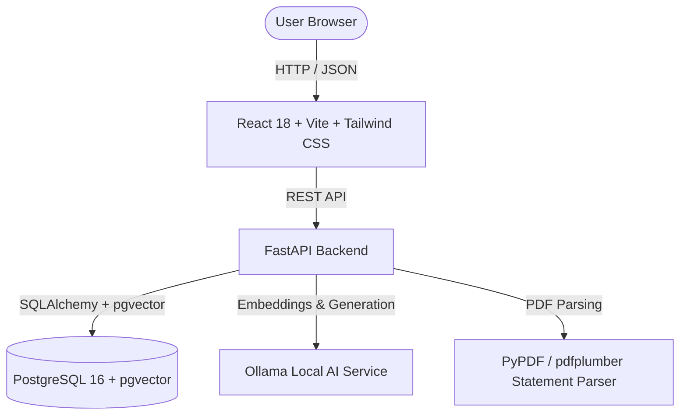

# 💰 WiseRaman — AI-Powered Personal Finance & Statement Intelligence

<div align="center">


**WiseRaman** is a local-first, privacy-focused personal finance intelligence platform tailored specifically for Indian banking ecosystems (SBI, HDFC, Axis, Federal Bank, OneCard, UPI, NEFT, IMPS). It parses complex multi-page PDF statements with deterministic balance verification, embeds transaction narrations via `pgvector`, and provides local RAG querying powered by Ollama.

</div>

---

## 🌟 Key Features

### 1. 📄 Multi-Bank Statement Parser & Math Verifier
- **Supported Banks & Cards:**
  - **HDFC Bank:** Savings Account statements, NetBanking exports, and Tata Neu / Regalia / Millennia Credit Card statements.
  - **State Bank of India (SBI):** Savings passbooks and SBI SimplyCLICK / Cashback Credit Card statements.
  - **Axis Bank:** Airtel Axis, Neo, and Flipkart Axis statements.
  - **Federal Bank & OneCard:** Credit card monthly statements.
- **Strict Verification Algorithm:**
  - Validates `Opening Balance + Deposits - Withdrawals = Closing Balance`.
  - Blocks duplicate statement uploads using cryptographic SHA-256 fingerprinting.

### 2. 💼 Salary Payslips & Tax Intelligence
- **AI-Powered Payslip Extraction:** Powered by local Ollama (`qwen2.5:3b`) with structured JSON schema output to accurately parse employer salary slips (Basic, HRA, Allowances, PF, PT, TDS, and Net Pay).
- **Automated Ledger Linking:** Intelligently matches payslip Net Pay to salary credit transactions in your bank accounts and auto-links them.
- **Interactive Drill-Down Cards:** Expandable payslip history cards detailing the full breakdown of earnings, statutory deductions, employee metadata, and in-hand take-home ratios.
- **Search, Filters & Pagination:** Easily query past payslips by employer, calendar year, or employee ID with configurable page sizes and sorting.
- **Deduction Trajectory Charts:** Visual tracking of gross income vs net take-home and accumulated Provident Fund (EPF) and tax withholdings over time.

### 3. 🤖 Local AI & Semantic RAG Assistant
- **100% Private & Local:** Powered by **Ollama** running locally on your hardware.
- **Embedding Search:** 768-dimensional vector embeddings generated using `nomic-embed-text` stored in PostgreSQL with `pgvector`.
- **Natural Language Financial Agent:** Ask questions like:
  - *"How much did I spend on groceries across Blinkit and Zepto last month?"*
  - *"What were my top recurring utility payments in Q2?"*
- **Indian Merchant Engine:** Fast deterministic mapping for 100+ Indian merchants (Swiggy, Zomato, Blinkit, Zepto, CRED, IRCTC, D-Mart, etc.).

### 4. 📊 Advanced Financial Intelligence & Analytics
- **Burn Rate & Net Savings %:** Dynamic monthly category stacking with net savings rate tracking.
- **Calendar Spend Heatmap:** GitHub-style 365-day intensity grid identifying weekend spending spikes.
- **Interactive Category Drilldown:** Deep-dive modal with merchant rankings, 6-month sparklines, and raw transaction ledgers.
- **Mandate Watchdog:** Automated recurring bill and subscription detector with impending due date alerts.
- **Payment Rail Split:** Visual breakdown of UPI vs Credit Card vs NetBanking outflows.

### 5. 💳 Credit Card & Account Portfolio Management
- **Unified Multi-File Ingestion:** Universal modal supporting batch uploads of bank statements and salary payslips with non-blocking background progress tracking.
- **Credit Card Cycle Tracker:** Tracks unbilled spends, total dues, statement dates, and payment due dates.
- **Historical Archive Vault:** Dedicated archive storage for legacy data exports (e.g. Walnut / Axio) isolated from active living expenses.
- **Neumorphic & Minimalist Themes:** Custom Dark and Light neumorphic design system.

---

## 🏗️ Architecture & Tech Stack



- **Frontend:** React 18, Vite, Tailwind CSS v4, Lucide Icons, Recharts.
- **Backend:** FastAPI, SQLAlchemy ORM, Pydantic v2, PyPDF.
- **Database:** PostgreSQL 16 with `pgvector` extension.
- **AI Engine:** Ollama (`qwen2.5:3b` for synthesis, `nomic-embed-text` for 768-dim embeddings).
- **Deployment:** Docker Compose multi-container stack.

---

## 🚀 Quickstart & Installation

### Prerequisites
- [Docker](https://docs.docker.com/get-docker/) and [Docker Compose](https://docs.docker.com/compose/install/)
- (Optional) [Ollama](https://ollama.com/) if running native on host

### Step 1: Clone the Repository
```bash
git clone https://github.com/abhaykeluskar/wise-raman.git
cd wise-raman
```

### Step 2: Start with Docker Compose
```bash
docker compose up -d --build
```

### Step 3: Pull Ollama Models (if not already downloaded)
```bash
docker exec -it finance_ollama ollama pull qwen2.5:3b
docker exec -it finance_ollama ollama pull nomic-embed-text
```

### Step 4: Open the Web UI
- **Frontend Dashboard:** [http://localhost:5173](http://localhost:5173)
- **FastAPI Interactive Swagger Docs:** [http://localhost:8000/docs](http://localhost:8000/docs)

---

## ⚙️ Environment Variables

| Variable | Default Value | Description |
| :--- | :--- | :--- |
| `DATABASE_URL` | `postgresql://postgres:local_secret_password@db:5432/finance_db` | PostgreSQL connection string with pgvector |
| `OLLAMA_URL` | `http://finance_ollama:11434` | Ollama service endpoint |
| `LLM_MODEL` | `qwen2.5:3b` | Default LLM model for synthesis |
| `EMBEDDING_MODEL` | `nomic-embed-text` | 768-dimension embedding model |
| `LLM_TEMPERATURE` | `0.0` | Sampling temperature for classification |

---

## 🔒 Security & Privacy Notice
- **Zero Cloud Telemetry:** All statement text, transactions, and vector embeddings remain 100% on your local machine.
- **Sensitive Data Exclusion:** Never commit raw bank statement PDFs or personal CSV dumps to GitHub.

---

## 📄 License
Distributed under the **MIT License**. See [`LICENSE`](./LICENSE) for more information.
